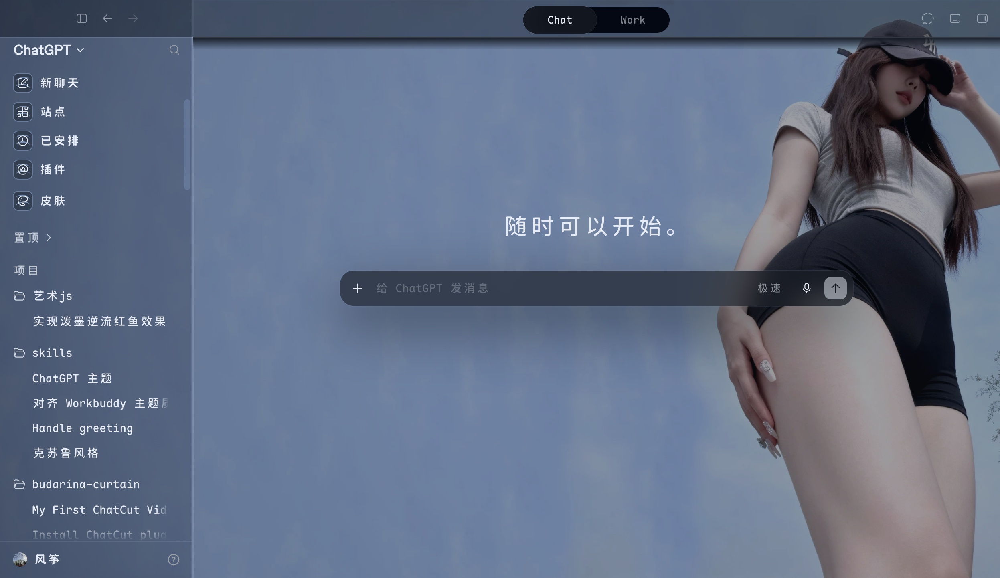
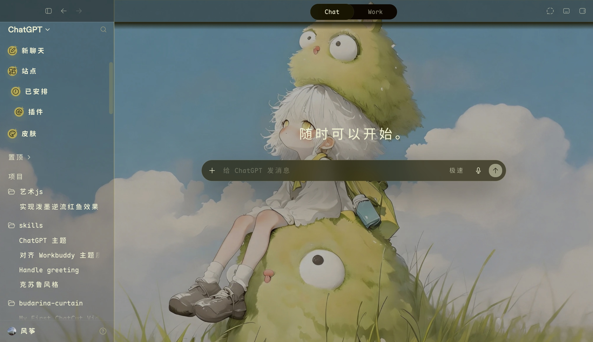
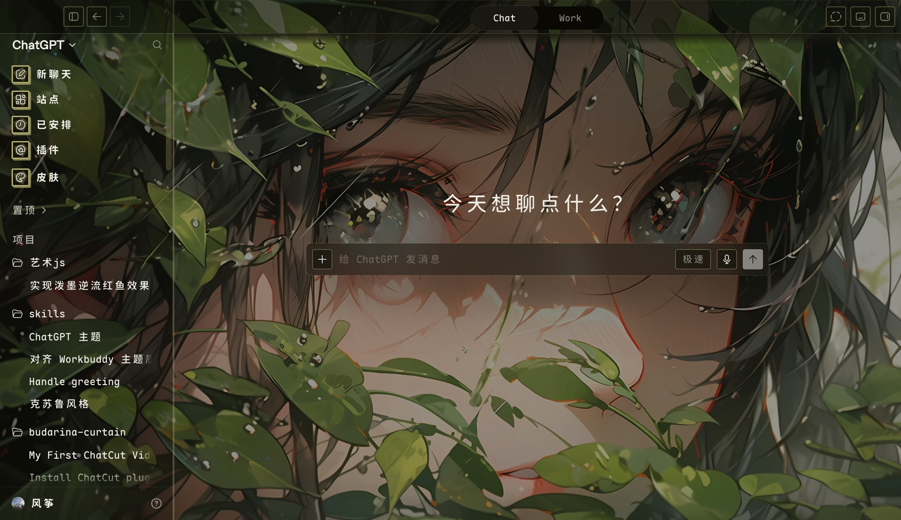
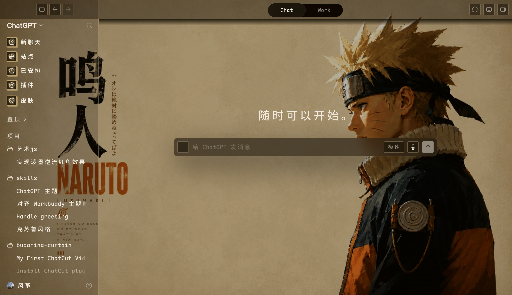

# Codex Skin Studio

[中文](README.md) · [English](README.en.md)

Full-interface, local image- and MP4-driven skins for the macOS Codex desktop app. Skin Studio coordinates the sidebar, title bar, workspace, cards, composer, menus, settings, and dialogs instead of tiling the same wallpaper into separate regions.

<p align="center">
  <video src="https://github.com/user-attachments/assets/95fe8248-2b05-43fa-a326-4b05a29722eb" width="60%" controls muted loop></video>
  <br>
  <em>A full interface walkthrough: Home → Skin manager → Sites → Scheduled → Plugins</em>
</p>

> [!IMPORTANT]
> This is an unofficial project. It currently supports macOS and the signed Codex desktop app with bundle identifier `com.openai.codex`. It never patches the app bundle, `app.asar`, its code signature, or `~/.codex/config.toml`.

## Gallery

The background media keeps its original color treatment. Skin Studio separately derives accessible interface colors, translucency, control shapes, and text contrast. Every preview below is a real locally saved skin.

### Video themes (local MP4 · live motion)

Previews are high-res looping animations — **click any preview to open its full-quality MP4**.

<table>
  <tr>
    <td width="50%" align="center"><a href="docs/images/地球.mp4"></a><br><b>地球 · Earth</b></td>
    <td width="50%" align="center"><a href="docs/images/猫咪.mp4"></a><br><b>猫咪 · Cat</b></td>
  </tr>
  <tr>
    <td align="center"><a href="docs/images/清冷.mp4"></a><br><b>清冷 · Cool</b></td>
    <td align="center"><a href="docs/images/山谷.mp4"></a><br><b>山谷 · Valley</b></td>
  </tr>
  <tr>
    <td align="center"><a href="docs/images/浪花.mp4"></a><br><b>浪花 · Wave</b></td>
    <td align="center"><a href="docs/images/旷野.mp4"></a><br><b>旷野 · Wilds</b></td>
  </tr>
  <tr>
    <td align="center"><a href="docs/images/发光刀刃.mp4"></a><br><b>发光刀刃 · Blade</b></td>
    <td align="center"><a href="docs/images/伏提庚.mp4"></a><br><b>伏提庚</b></td>
  </tr>
  <tr>
    <td align="center"><a href="docs/images/古风美女.mp4"></a><br><b>古风美女 · Classical</b></td>
   
  </tr>
 
</table>

### Image themes (high-res stills)

<table>
  <tr>
    <td width="50%" align="center"><br><b>户外 · Outdoor</b></td>
    <td width="50%" align="center"><br><b>小野花 · Wildflower</b></td>
  </tr>
  <tr>
    <td align="center"><br><b>毛绒 · Plush</b></td>
    <td align="center"><br><b>绿感 · Verdant</b></td>
  </tr>
  <tr>
    <td colspan="2" align="center"><br><b>鸣人 · Naruto</b></td>
  </tr>
</table>


The screenshots show real locally saved skins. Their original image and video files are not included in this repository.

## Highlights

- One image or local looping MP4 covers the complete Codex window, with focal point, opacity, content clarity, and blur controls.
- A native-style **Skin** sidebar entry and in-app theme manager.
- Restrained, automatic Open, and Skill-generated AI design modes.
- Accessible UI palettes derived from the media without recoloring, saturating, desaturating, or grading the source image/video.
- Structured **Design UI** generation for media-specific navigation rhythm, landing composition, cards, controls, and stagecraft.
- Saved-theme switching, renaming, deletion, pause, and one-click official restoration.
- Compatibility preflight, bounded rollback, and poster-frame fallback for video failures.

## Install

### Option 1: double-click installer

1. Choose **Code → Download ZIP** on GitHub and extract the complete repository.
2. Right-click `Install Codex Skin Studio.command` and choose **Open**.
3. The installer verifies Codex, installs the Skill to `~/.codex/skills/codex-skin-studio`, and creates Desktop launchers.
4. Restart Codex once so it discovers the new Skill.

The first launch of a downloaded `.command` file may require confirmation from macOS. Use **Open** from the context menu; do not disable system security protections.

### Option 2: Terminal

```bash
git clone https://github.com/huzhicheng/codex-skin-studio.git
cd codex-skin-studio
./install.sh
```

Install and attempt activation immediately:

```bash
./install.sh --activate
```

The installer is safe to rerun for upgrades. Updating the Skill does not remove saved local themes.

### Option 3: ask Codex

Give Codex this repository URL and say:

> Use skill-installer to install the Skill at `skills/codex-skin-studio` from this repository.

After installation and one Codex restart, say:

> Use codex-skin-studio to install the Desktop launchers.

## First run

Ask Codex:

> Use codex-skin-studio to start the skin manager.

Or use the Desktop launchers:

- `Codex Skin Studio.command`: starts on demand and asks before a required restart.
- `Codex Skin Studio - Auto Start.command`: a user-initiated one-click activation handoff.
- `Codex Skin Studio - Restore.command`: removes the skin and restarts Codex normally.

Once active, **Skin** appears in the primary Codex sidebar. Choose an image or MP4, adjust its focal point, switch between Restrained and Open, or click **Design UI** to create a media-specific structured design. Generated designs remain saved with their skins and can be replaced or switched back to the automatic template without deleting them.

## Manager vs. Skill

The in-app manager handles frequent visual actions: importing media, switching skins, adjusting strength, deleting themes, and restoring appearance.

The `codex-skin-studio` Skill handles installation, compatibility diagnostics, safe activation and recovery, plus the reasoning step that analyzes the current media and produces a constrained structured UI design. It is not merely a fixed template recolor.

## Interface modes

- **Restrained** keeps native Codex control proportions and applies coordinated surfaces and theme colors.
- **Open** uses an automatic expressive template for the landing page, navigation states, buttons, cards, and composer.
- **AI design** applies the independent structured design generated for the current media.
- **Generation boldness** controls the next Design UI request (Subtle, Wild, or Crazy) without changing the source image colors.

## Commands

```bash
SKILL_ROOT="${CODEX_HOME:-$HOME/.codex}/skills/codex-skin-studio"

/bin/bash "$SKILL_ROOT/scripts/skin-studio.sh" doctor
/bin/bash "$SKILL_ROOT/scripts/skin-studio.sh" install-launchers
/bin/bash "$SKILL_ROOT/scripts/skin-studio.sh" start
/bin/bash "$SKILL_ROOT/scripts/skin-studio.sh" status
/bin/bash "$SKILL_ROOT/scripts/skin-studio.sh" restore
/bin/bash "$SKILL_ROOT/scripts/skin-studio.sh" restore --restart
```

## Restore and uninstall

Live restore without restarting Codex:

```bash
/bin/bash "${CODEX_HOME:-$HOME/.codex}/skills/codex-skin-studio/scripts/skin-studio.sh" restore
```

Full restore and normal restart:

```bash
/bin/bash "${CODEX_HOME:-$HOME/.codex}/skills/codex-skin-studio/scripts/skin-studio.sh" restore --restart
```

Remove the Skill and launchers while preserving local themes:

```bash
./uninstall.sh
```

Remove local themes and logs as well:

```bash
./uninstall.sh --restart --purge-data
```

## Troubleshooting

### The Skin entry does not appear

Restart Codex once after installation, then use `Codex Skin Studio - Auto Start.command`, or run `doctor` followed by `start`. A failed compatibility check rolls back the visual layer and keeps Codex available; it does not enter an automatic restart loop.

### A Codex update breaks the layout

Run `doctor` and `status`. Skin Studio fails closed when shell markers no longer match. Use `restore` to keep working with the official interface, then update Skin Studio.

### The image does not fill the window, or the subject is too large

The canvas uses full-window `cover`, so it does not shrink to create empty borders. Use the focal-point control to protect the subject; large media/window aspect-ratio differences necessarily crop the outer edges.

### MP4 playback fails

Playback and decode errors stay inside the visual layer. The locally extracted poster frame remains visible and the error never restarts Codex.

### Contrast changes after switching ChatGPT/Codex workspaces

Since v0.16.3, Skin Studio reconciles active skin tokens across workspace changes and independently protects sidebar labels, icons, and the active Send/Stop action. v0.16.4 additionally isolates native overlay navigation such as the profile menu and Settings so decorative rescans cannot block the renderer.

## Privacy and security

- Imported images and MP4 files remain local by default.
- Only an explicit **Design UI** click sends the active still image or the locally extracted poster frame to one ephemeral Codex design request. The MP4 itself is never exported.
- Generated output must pass the bundled versioned structured schema. Arbitrary CSS, HTML, JavaScript, URLs, remote fonts, and shell commands are rejected.
- The debugging endpoint binds to loopback, and renderer targets must pass `app://` plus Codex-shell verification.
- Skin mode uses an isolated Chromium profile and does not copy Cookies, Local Storage, Preferences, or session files from the official profile.
- Activation is a single bounded attempt. A failed preflight rolls back the skin, stops the watcher, and leaves Codex running without retries.

See the [security policy](SECURITY.md) and [runtime security model](skills/codex-skin-studio/references/security.md).

## License

[MIT License](LICENSE). This project is not affiliated with or endorsed by OpenAI. Media visible in screenshots is not included in the software distribution.
