# Codex Skin Studio

[中文](README.md) · [English](README.en.md)

给 macOS Codex 桌面应用换上由本地图片或 MP4 驱动的完整界面皮肤。它会统一处理左侧导航、标题栏、工作区、卡片、输入区、菜单、设置页和弹窗，而不是在每个区域重复平铺一张壁纸。

<p align="center">
  <video src="https://github.com/user-attachments/assets/95fe8248-2b05-43fa-a326-4b05a29722eb" width="60%" autoplay muted loop playsinline controls></video>
  <br>
  <em>“彩色” · 一段完整界面巡览：首页 → 皮肤管理 → 站点 → 已安排 → 插件</em>
</p>

> [!IMPORTANT]
> 这是非 OpenAI 官方项目。目前仅支持 macOS 与签名有效的 Codex 桌面应用（bundle id：`com.openai.codex`）。项目不会修改 Codex 应用包、`app.asar`、代码签名或 `~/.codex/config.toml`。

## 效果预览

皮肤可以使用静态图片，也可以使用本地循环 MP4。背景媒体始终保持原始色调；界面色板、层次、控件形态和可读性由 Skin Studio 单独处理。以下均为真实保存的本机皮肤。

### 视频主题（本地 MP4 · 界面实时动态）

预览为高清循环动图。

<table>
  <tr>
    <td width="50%" align="center">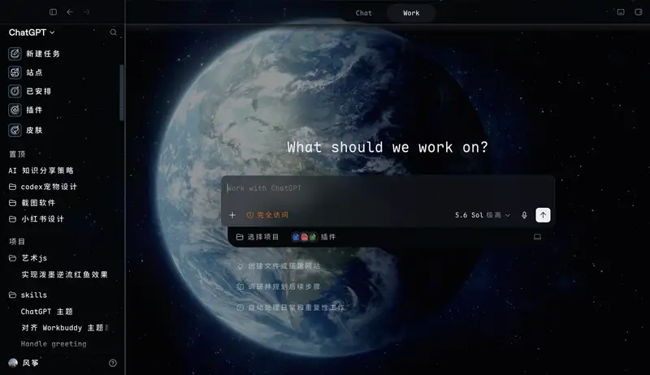<br><b>地球</b></td>
    <td width="50%" align="center">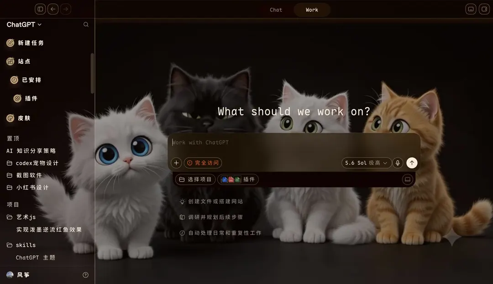<br><b>猫咪</b></td>
  </tr>
  <tr>
    <td align="center">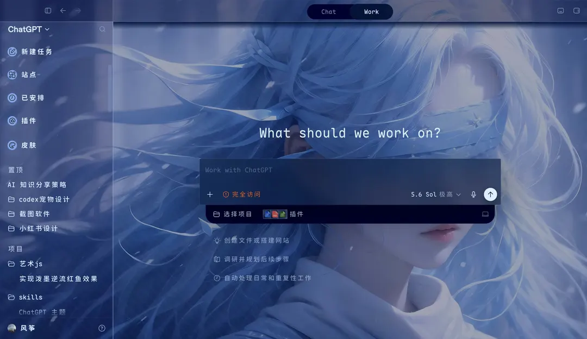<br><b>清冷</b></td>
    <td align="center">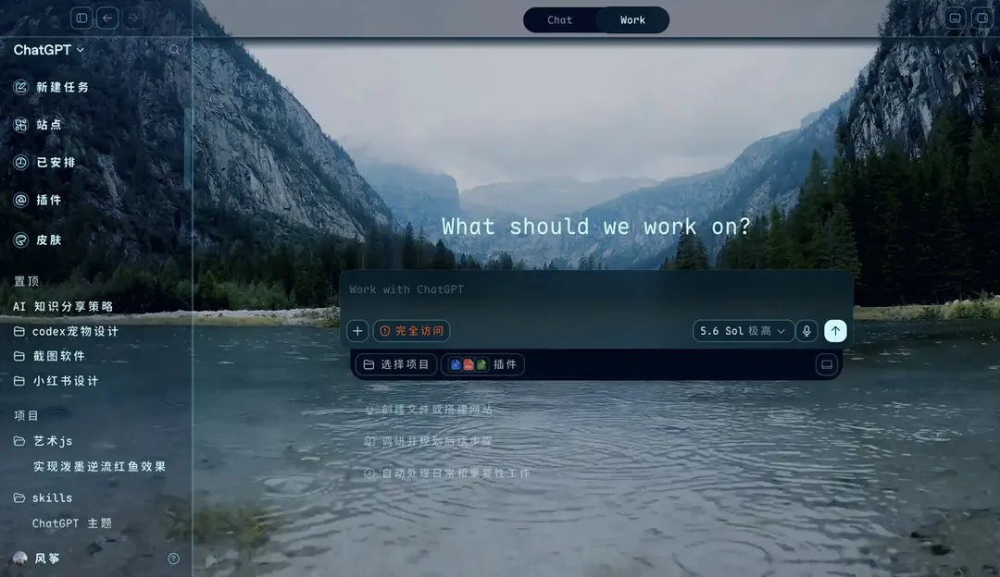<br><b>山谷</b></td>
  </tr>
  <tr>
    <td align="center">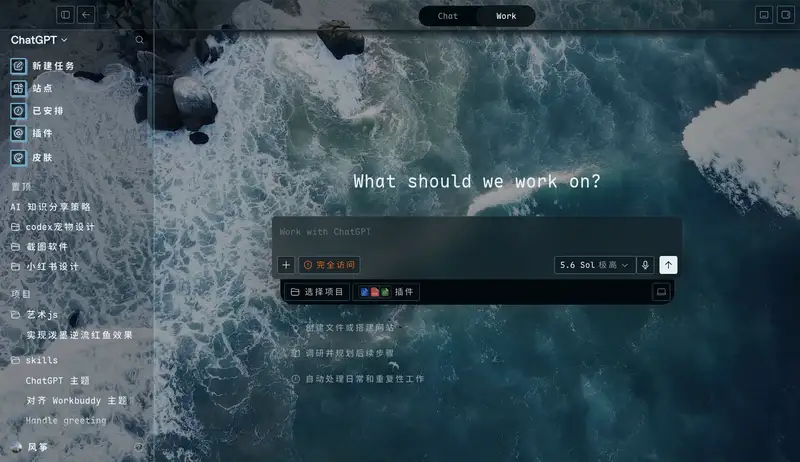<br><b>浪花</b></td>
    <td align="center">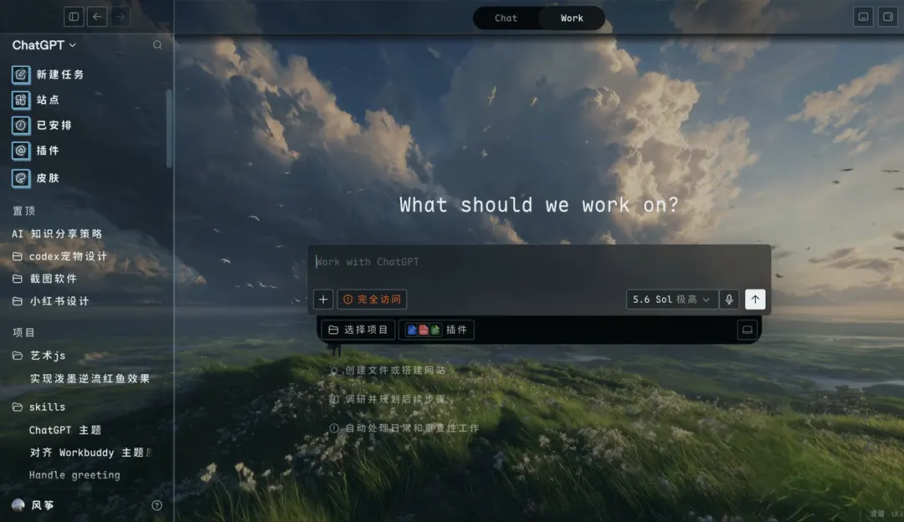<br><b>旷野</b></td>
  </tr>
  <tr>
    <td align="center">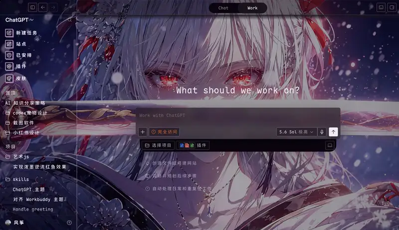<br><b>发光刀刃</b></td>
    <td align="center">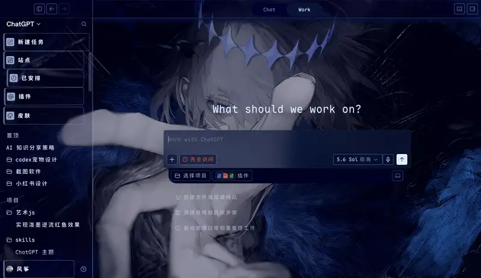<br><b>伏提庚</b></td>
  </tr>
  <tr>
    <td align="center">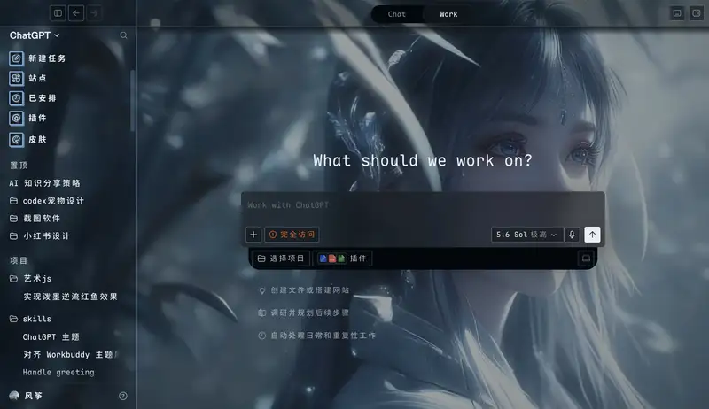<br><b>古风美女</b></td>
  
  </tr>

</table>

### 图片主题（高清静态截图）

<table>
  <tr>
    <td colspan="2" align="center">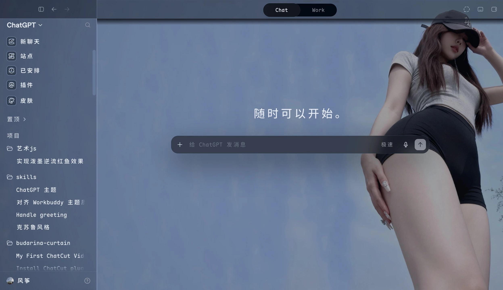<br><b>户外</b></td>
  </tr>
  <tr>
    <td width="50%" align="center">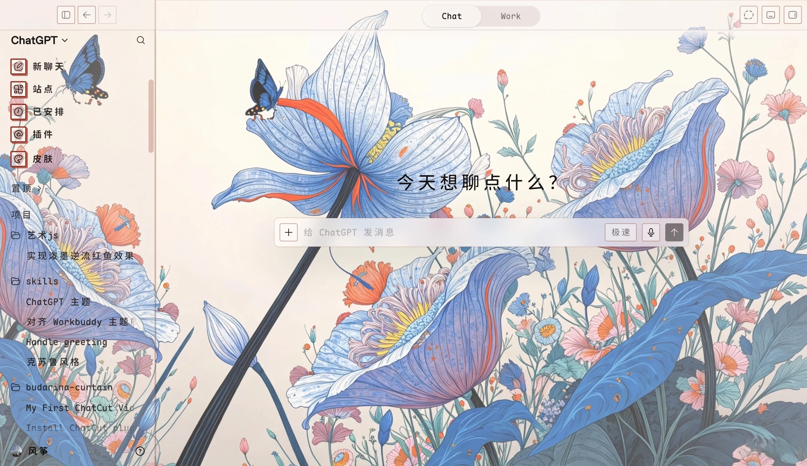<br><b>小野花</b></td>
    <td width="50%" align="center">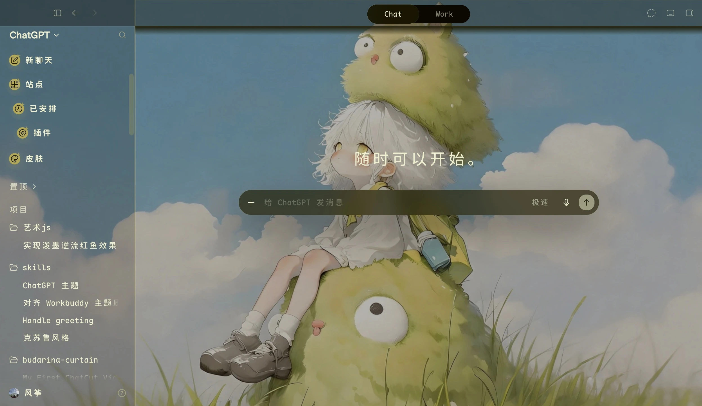<br><b>毛绒</b></td>
  </tr>
  <tr>
    <td align="center">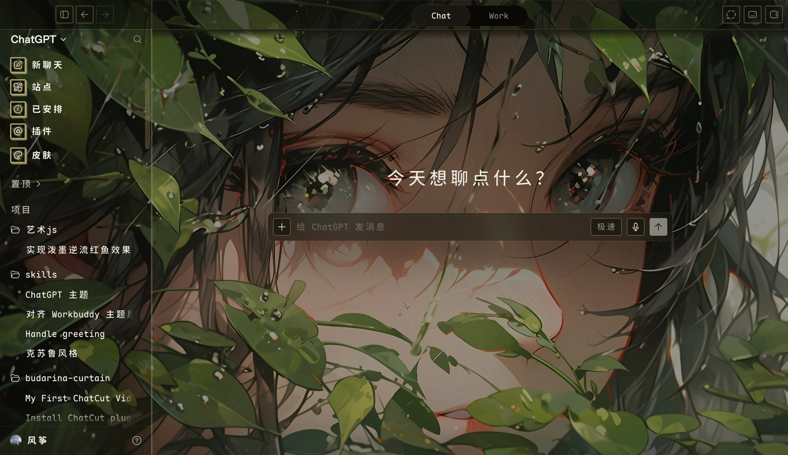<br><b>绿感</b></td>
    <td align="center">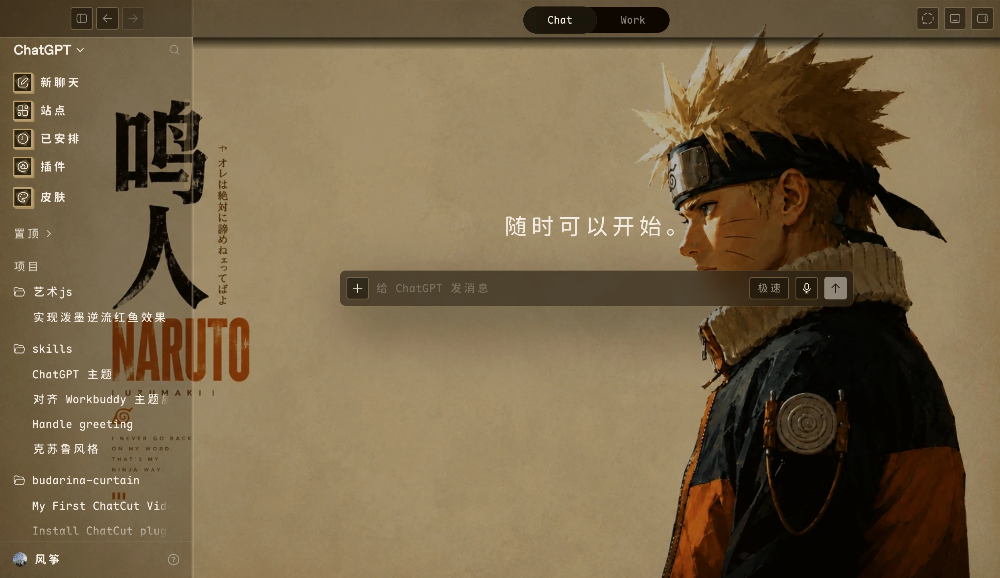<br><b>鸣人</b></td>
  </tr>
</table>


截图来自真实保存的本地皮肤，仅用于展示界面效果；仓库不包含截图中的原始主题图片或视频。

## 主要能力

- 一张图片或一个 MP4 覆盖整个 Codex 窗口，自动 `cover` 铺满并支持焦点位置、透明度、内容清晰度和模糊调节。
- 原生风格的“皮肤”侧栏入口，以及应用内的保存、切换、重命名、删除和暂停管理。
- **内敛**、**灵动**和 Skill 生成的 **AI 设计**三种界面语言。
- 从媒体提取可访问的界面色板，但不对背景媒体做增艳、变色、黑白、双色或电影调色。
- “设计UI”会根据当前图片或 MP4 封面帧生成受约束的结构化 Open 方案，可独立设计导航节奏、标题、首页构图、卡片和按钮。
- 自动适配 Codex 的浅色/深色状态，并保护导航图标、文字、发送/停止按钮的对比度。
- Codex 更新后的兼容性预检、异常回滚、视频封面回退和一键恢复官方界面。

## 安装

### ⭐ 最省事：让你的 AI 帮你装（推荐，不用懂命令行）

你既然在用 Codex，那最简单的装法就是把下面这段话，**整段复制发给它**：

> 帮我安装 github.com/huzhicheng/codex-skin-studio 这个 skill。请务必用 `git clone` 下载整个仓库、再运行里面的 `./install.sh` 来装，这样才会自动在我桌面创建三个中文启动器。装完告诉我去桌面双击「Codex皮肤 - 一键启动」就能用。

那句「用 install.sh 装」很关键，别删——要是 agent 图省事只把文件夹拷进 `~/.codex/skills/`，Skill 是装上了，但**不会创建桌面启动器**（这就是启动器没自动出现的常见原因）。

装好后桌面会出现三个中文入口：「Codex皮肤 - 启动」「Codex皮肤 - 一键启动」「Codex皮肤 - 恢复官方」。然后直接去桌面**双击「Codex皮肤 - 一键启动」**就能用——它会自动重启 Codex 并载入皮肤，你不用自己手动重启。

万一桌面还是没出现那三个入口，就再对它说一句：「用 codex-skin-studio 安装桌面启动器」（它会补建，不用重装）。

### 或者：下载后双击安装

1. 在本页面点绿色的 **Code → Download ZIP**，下载后解压。
2. 打开解压出来的文件夹，**右键**点里面的 `Install Codex Skin Studio.command`，选「打开」。
3. 它会自动装好、并在桌面建好入口。然后双击桌面的「Codex皮肤 - 一键启动」就能用——它会自动重启 Codex 并载入皮肤，不用你手动重启。

（macOS 第一次打开这个文件，可能提示"来源不明"，右键选「打开」就行，不用关任何安全设置。）

### 熟悉终端的话

```bash
git clone https://github.com/huzhicheng/codex-skin-studio.git
cd codex-skin-studio
./install.sh
```

重复运行 `./install.sh` 就是升级，不会删掉你已经保存的皮肤。

## 第一次使用

装完后，桌面上会有三个入口。最常用的是「Codex皮肤 - 一键启动」，双击它，皮肤模式就开起来了。

- 「Codex皮肤 - 一键启动」：双击开启皮肤模式，需要重启 Codex 时会自动处理。
- 「Codex皮肤 - 启动」：按需启动；如果确实要重启，会先问你一句。
- 「Codex皮肤 - 恢复官方」：一键清掉皮肤，变回官方界面。

也可以直接对 Codex 说「使用 codex-skin-studio 启动皮肤管理器」，效果一样。

启动成功后，「皮肤」会出现在 Codex 左侧的功能区。接下来这么玩：

1. 点「皮肤」，选一张图片或一个 MP4。
2. 拖一下焦点，让人物或主体停在合适的位置。
3. 在「内敛」和「灵动」之间随手切换，看哪个顺眼。
4. 想要这张图专属的界面风格，就选个生成胆量、点 **设计UI**。
5. 生成好之后切到「AI 设计」；不满意可以重新生成，或随时切回自动的「灵动」。

## 面板和 Skill 分别做什么

应用内面板负责高频、可视化操作：导入媒体、切换皮肤、调整强度、删除主题和恢复外观。

`codex-skin-studio` Skill 负责需要推理或系统边界的工作：首次安装、兼容性诊断、安全启动、异常恢复，以及读取当前媒体后生成符合结构化安全约束的独立 UI 设计。换一张图片后再次点击“设计UI”，得到的是属于这张图片的新方案，不是固定模板换色。

## 界面风格

- **内敛**：保留 Codex 原生控件比例，用主题色和半透明材质统一全窗口。
- **灵动**：自动 Open 模板，会改变首页、导航选中态、按钮、卡片和输入区的表现。
- **AI 设计**：由 Skill 为当前媒体生成的独立结构化方案；生成前不可选，生成后会和当前皮肤一起保存。
- **生成胆量**：沉稳、奔放、疯狂只影响下一次“设计UI”的结构大胆程度，不会改变原图色调。

## 平时怎么开关皮肤

不用记命令，双击桌面入口就行：

- **开皮肤**：双击「Codex皮肤 - 一键启动」。
- **变回官方界面**：双击「Codex皮肤 - 恢复官方」。
- **想自检一下**：对 Codex 说「使用 codex-skin-studio 跑一下 doctor」。

熟悉终端的话，这些动作也都封装在了 `~/.codex/skills/codex-skin-studio/scripts/skin-studio.sh` 里，比如 `doctor`、`start`、`status`、`restore`。

## 卸载

想彻底卸载，最省事的是对 Codex 说「帮我卸载 codex-skin-studio」。它会清掉工具和桌面入口，你保存的皮肤默认保留。

熟悉终端的话：

```bash
# 卸载，保留已存皮肤
~/.codex/skills/codex-skin-studio/scripts/uninstall.sh
# 连本地皮肤和日志一起删
~/.codex/skills/codex-skin-studio/scripts/uninstall.sh --restart --purge-data
```

## 常见问题

### 装完没有「皮肤」入口

「皮肤」按钮是在皮肤模式启动之后才会出现在侧栏的，所以先去桌面**双击「Codex皮肤 - 一键启动」**——它会重启 Codex 并载入皮肤。双击后还是没有的话，就对 Codex 说「使用 codex-skin-studio 跑一下 doctor 再启动」。如果干净启动正常、只是皮肤没起来，工具会自动撤掉注入、保持 Codex 能正常用，不会反复重启。

### Codex 升级后界面卡住或入口消失

先双击「Codex皮肤 - 恢复官方」变回官方界面，把 Codex 更新好，再重新启动皮肤。也可以对 Codex 说「使用 codex-skin-studio 跑一下 doctor 和 status」看看哪里不对；选择器不兼容时它会安全关闭，不会乱改你的应用。

### 图片没铺满，或者人物太大

背景默认整窗铺满，不会为了显示完整图片而缩小留白。用管理器里的「焦点位置」把主体拖到合适的地方；图片和窗口比例差很多时，边缘会裁掉一点。

### MP4 播不了

视频解码或播放失败只影响画面层，工具会自动保留本地封面帧顶上，不会因此重启 Codex。

### 深浅色切换后，文字或停止按钮看不清

新版会在深浅色切换时重新校准皮肤配色，并单独保护导航文字、图标和发送/停止按钮的对比度。万一还是看不清，双击「Codex皮肤 - 恢复官方」，再重新启动一次皮肤就好。

## 隐私与安全

- 图片和 MP4 默认只保存在本机的 Skin Studio 数据中。
- 只有你主动点击 **设计UI** 时，当前图片或 MP4 的本地封面帧才会交给一次临时 Codex 设计请求；MP4 文件本身不会发送。
- 生成结果必须通过版本化结构化方案校验，不接受任意 CSS、HTML、JavaScript、URL、远程字体或 shell 命令。
- 调试端口只绑定 `127.0.0.1`，目标还必须通过 `app://` 与 Codex 壳层校验。
- 皮肤模式使用独立 Chromium 用户目录，不复制官方配置中的 Cookies、Local Storage、Preferences 或会话文件。
- 启动只有一次有界尝试；检查失败时回滚皮肤并保留 Codex，不进入自动重启循环。

完整边界见 [安全策略](SECURITY.md) 与 [运行时安全模型](skills/codex-skin-studio/references/security.md)。

## 许可

[MIT License](LICENSE)。本项目与 OpenAI 无隶属或背书关系。截图中的主题媒体不包含在软件发行包中。
